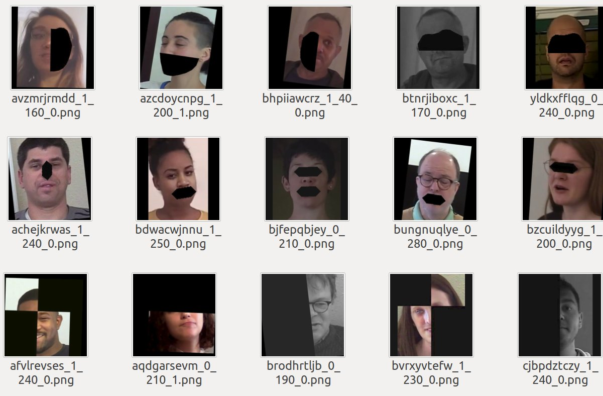
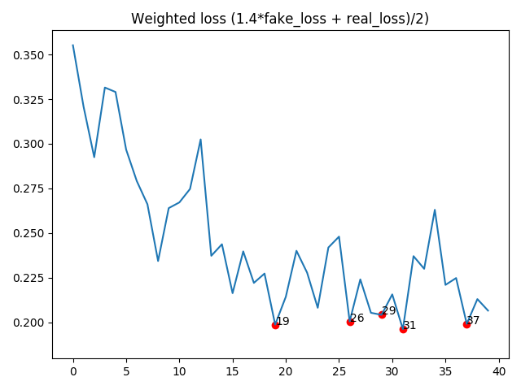

## DeepFake Detection (DFDC) Solution by @selimsef

## Challenge details:

[Kaggle Challenge Page](https://www.kaggle.com/c/deepfake-detection-challenge)


### Fake detection articles  
- [The Deepfake Detection Challenge (DFDC) Preview Dataset](https://arxiv.org/abs/1910.08854)
- [Deep Fake Image Detection Based on Pairwise Learning](https://www.mdpi.com/2076-3417/10/1/370)
- [DeeperForensics-1.0: A Large-Scale Dataset for Real-World Face Forgery Detection](https://arxiv.org/abs/2001.03024)
- [DeepFakes and Beyond: A Survey of Face Manipulation and Fake Detection](https://arxiv.org/abs/2001.00179)
- [Real or Fake? Spoofing State-Of-The-Art Face Synthesis Detection Systems](https://arxiv.org/abs/1911.05351)
- [CNN-generated images are surprisingly easy to spot... for now](https://arxiv.org/abs/1912.11035)
- [FakeSpotter: A Simple yet Robust Baseline for Spotting AI-Synthesized Fake Faces](https://arxiv.org/abs/1909.06122)
- [FakeLocator: Robust Localization of GAN-Based Face Manipulations via Semantic Segmentation Networks with Bells and Whistles](https://arxiv.org/abs/2001.09598)
- [Media Forensics and DeepFakes: an overview](https://arxiv.org/abs/2001.06564)
- [Face X-ray for More General Face Forgery Detection](https://arxiv.org/abs/1912.13458)

## Solution description 
In general solution is based on frame-by-frame classification approach. Other complex things did not work so well on public leaderboard.

#### Face-Detector
MTCNN detector is chosen due to kernel time limits. It would be better to use S3FD detector as more precise and robust, but opensource Pytorch implementations don't have a license. 

Input size for face detector was calculated for each video depending on video resolution.

- 2x scale for videos with less than 300 pixels wider side
- no rescale for videos with wider side between 300 and 1000
- 0.5x scale for videos with wider side > 1000 pixels
- 0.33x scale for videos with wider side > 1900 pixels

### Input size
As soon as I discovered that EfficientNets significantly outperform other encoders I used only them in my solution.
As I started with B4 I decided to use "native" size for that network (380x380).
Due to memory costraints I did not increase input size even for B7 encoder.

### Margin
When I generated crops for training I added 30% of face crop size from each side and used only this setting during the competition. 
See [extract_crops.py](preprocessing/extract_crops.py) for the details

### Encoders
The winning encoder is current state-of-the-art model (EfficientNet B7) pretrained with ImageNet and noisy student [Self-training with Noisy Student improves ImageNet classification
](https://arxiv.org/abs/1911.04252)

### Averaging predictions
I used 32 frames for each video.
For each model output instead of simple averaging I used the following heuristic which worked quite well on public leaderbord (0.25 -> 0.22 solo B5).
```python
import numpy as np

def confident_strategy(pred, t=0.8):
    pred = np.array(pred)
    sz = len(pred)
    fakes = np.count_nonzero(pred > t)
    # 11 frames are detected as fakes with high probability
    if fakes > sz // 2.5 and fakes > 11:
        return np.mean(pred[pred > t])
    elif np.count_nonzero(pred < 0.2) > 0.9 * sz:
        return np.mean(pred[pred < 0.2])
    else:
        return np.mean(pred)
```

### Augmentations

I used heavy augmentations by default. 
[Albumentations](https://github.com/albumentations-team/albumentations) library supports most of the augmentations out of the box. Only needed to add IsotropicResize augmentation.
```

def create_train_transforms(size=300):
    return Compose([
        ImageCompression(quality_lower=60, quality_upper=100, p=0.5),
        GaussNoise(p=0.1),
        GaussianBlur(blur_limit=3, p=0.05),
        HorizontalFlip(),
        OneOf([
            IsotropicResize(max_side=size, interpolation_down=cv2.INTER_AREA, interpolation_up=cv2.INTER_CUBIC),
            IsotropicResize(max_side=size, interpolation_down=cv2.INTER_AREA, interpolation_up=cv2.INTER_LINEAR),
            IsotropicResize(max_side=size, interpolation_down=cv2.INTER_LINEAR, interpolation_up=cv2.INTER_LINEAR),
        ], p=1),
        PadIfNeeded(min_height=size, min_width=size, border_mode=cv2.BORDER_CONSTANT),
        OneOf([RandomBrightnessContrast(), FancyPCA(), HueSaturationValue()], p=0.7),
        ToGray(p=0.2),
        ShiftScaleRotate(shift_limit=0.1, scale_limit=0.2, rotate_limit=10, border_mode=cv2.BORDER_CONSTANT, p=0.5),
    ]
    )
``` 
In addition to these augmentations I wanted to achieve better generalization with 
- Cutout like augmentations (dropping artefacts and parts of face)
- Dropout part of the image, inspired by [GridMask](https://arxiv.org/abs/2001.04086) and [Severstal Winning Solution](https://www.kaggle.com/c/severstal-steel-defect-detection/discussion/114254) 



## Building docker image
All libraries and enviroment is already configured with Dockerfile. It requires docker engine https://docs.docker.com/engine/install/ubuntu/ and  nvidia docker in your system https://github.com/NVIDIA/nvidia-docker.

To build a docker image run `docker build -t df .`

## Running docker 
`docker run --runtime=nvidia --ipc=host --rm  --volume <DATA_ROOT>:/dataset -it df`

## Data preparation

Once DFDC dataset is downloaded all the scripts expect to have `dfdc_train_xxx` folders under data root directory. 

Preprocessing is done in a single script **`preprocess_data.sh`** which requires dataset directory as first argument. 
It will execute the steps below:  

##### 1. Find face bboxes
To extract face bboxes I used facenet library, basically only MTCNN. 
`python preprocessing/detect_original_faces.py --root-dir DATA_ROOT`
This script will detect faces in real videos and store them as jsons in DATA_ROOT/bboxes directory

##### 2. Extract crops from videos
To extract image crops I used bboxes saved before. It will use bounding boxes from original videos for face videos as well.
`python preprocessing/extract_crops.py --root-dir DATA_ROOT --crops-dir crops`
This script will extract face crops from videos and save them in DATA_ROOT/crops directory
 
##### 3. Generate landmarks
From the saved crops it is quite fast to process crops with MTCNN and extract landmarks  
`python preprocessing/generate_landmarks.py --root-dir DATA_ROOT`
This script will extract landmarks and save them in DATA_ROOT/landmarks directory
 
##### 4. Generate diff SSIM masks
`python preprocessing/generate_diffs.py --root-dir DATA_ROOT`
This script will extract SSIM difference masks between real and fake images and save them in DATA_ROOT/diffs directory

##### 5. Generate folds
`python preprocessing/generate_folds.py --root-dir DATA_ROOT --out folds.csv`
By default it will use 16 splits to have 0-2 folders as a holdout set. Though only 400 videos can be used for validation as well. 


## Training

Training 5 B7 models with different seeds is done in **`train.sh`** script.

During training checkpoints are saved for every epoch.

## Hardware requirements
Mostly trained on devbox configuration with 4xTitan V, thanks to Nvidia and DSB2018 competition where I got these gpus https://www.kaggle.com/c/data-science-bowl-2018/
 
Overall training requires 4 GPUs with 12gb+ memory. 
Batch size needs to be adjusted for standard 1080Ti or 2080Ti graphic cards.

As I computed fake loss and real loss separately inside each batch, results might be better with larger batch size, for example on V100 gpus. 
Even though SyncBN is used larger batch on each GPU will lead to less noise as DFDC dataset has some fakes where face detector failed and face crops are not really fakes.   

## Plotting losses to select checkpoints

`python plot_loss.py --log-file logs/<log file>`



## Inference


Kernel is reproduced with `predict_folder.py` script.


## Pretrained models  
`download_weights.sh` script will download trained models to `weights/` folder. They should be downloaded before building a docker image.
 
Ensemble inference is already preconfigured with `predict_submission.sh` bash script. It expects a directory with videos as first argument and an output csv file as second argument.
 
For example `./predict_submission.sh /mnt/datasets/deepfake/test_videos submission.csv`  


